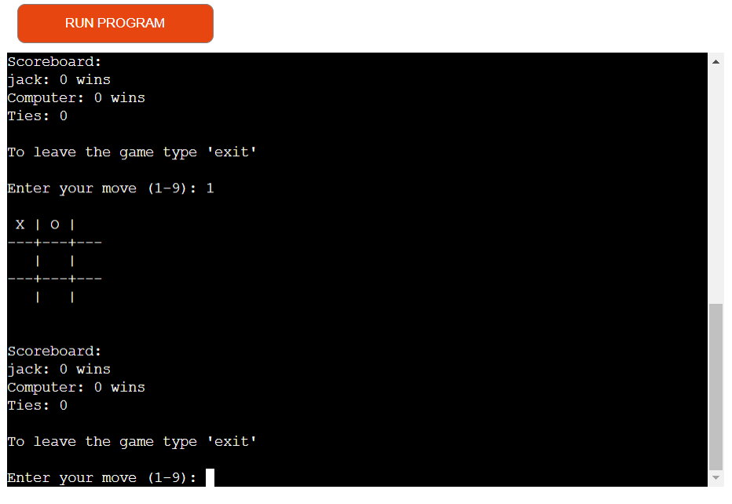
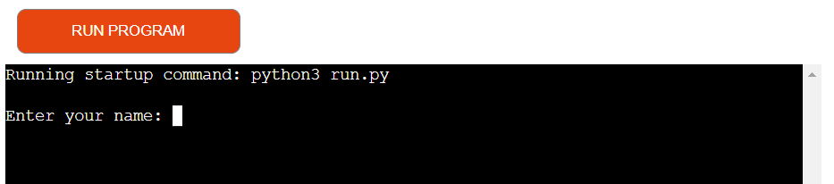
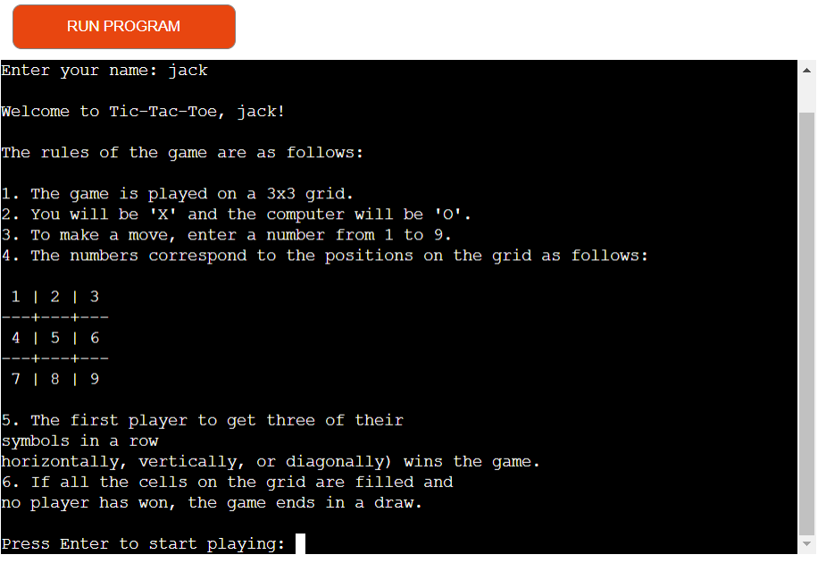
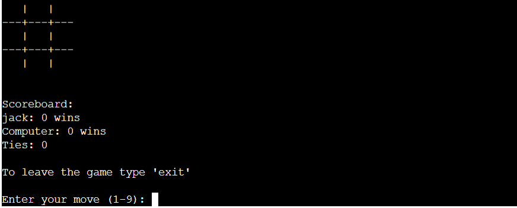
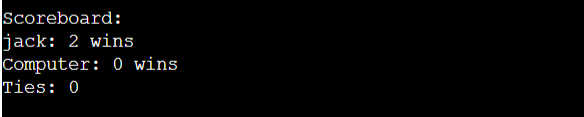
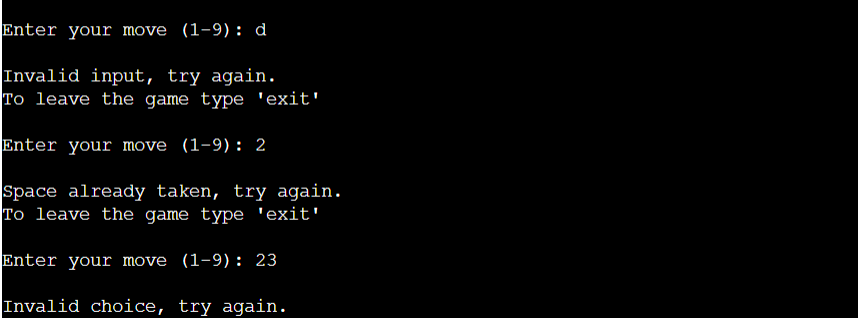

# Tic Tac Toe Game

Welcome to Tic-Tac-Toe, the classic two-player game! In this game, you will play as 'X' and the computer will be 'O', and you both will take turns to fill the 3x3 grid with your symbols. The first player to get three of their symbols in a row horizontally, vertically, or diagonally wins the game. If all the cells on the grid are filled and no player has won, the game ends in a draw.

The tic tac toe game is a python terminal game that runs on Code institutes mock terminal on Heroku.
 
 - Visit the game at https://tic-tac-toe-port.herokuapp.com/
 - For edecational purposes only.

 
## steps to play
- Start the game by running the code.
- Enter your name when prompted by the program.
- The program will display the rules of the game.
- To make a move, enter a number from 1 to 9 that corresponds to a position on the 3x3 grid.
- You will be playing as "X" and the computer will be playing as "O".
- After you enter your move, the computer will make its move.
 
## Features 
Below is a list of the different features for the game.

   
### Existing Features

  
- __Enter name__

  - Input for the player to enter thier name.

 

- __Intro to game__
 
   - After the player enters thier name a welcome message is printed with their name. 
   - Info is printed for the player so that they know how the game works.
   - A press enter option at the bottum of the page letting the player know what to do to play.

 
 
 
- __The game__

  - The bord is printed.
  - The player enters a number 1 to 9 that corresponds to a position on the 3x3 grid
  - There is a exit option for the player. they type exit to leave the game.
  
 

- __The Score Area__

  - Here the score is tallied bassed on the games outcome.
  - If either the win, lose, or tie score reaches 5 the game is completed and a message is printed bassed on the results.
  

 

- __Invalid input messages__
  - Different error messages will be displayed based on the input mistakes.
  - The player can only play with a valid number; 
  - otherwise, they will receive a corresponding error message and will be allowed to try
     again.

   

 

### Features Left to Implement 

- Add a play again option after the game ends.
- Make difficulty levels for the game.

## Testing 

 - The game was tested on multiple devices such as phone, tablet and desktop.
   The user experience was good on all.
 - All features function as intended.
 - All features are easy and straightforward to use.

### Validator Testing 

- PEP8
    - No errors were found when passing through the [PEP8 validator](https://pep8ci.herokuapp.com/)

### Unfixed Bugs

 - There are no unfixed bugs.

## Deployment
This project was deployed using Code Institute's mock terminal for Heroku.

- Create a new Heroku app.
- Set buildpacks to 'Python' and 'NodeJs' in that order 
- Create a Config Var called PORT. Set this to 8000
- Link the aheroku app to the repository
- Click on Deploy

## Credits 

- How to structure a README document was taken from Code Institutes template to create this README.md
- Help was taken from Code Institute's Student Support to create this project. 
- The idea for the game taken from youtube.
- google helped solve code problems.